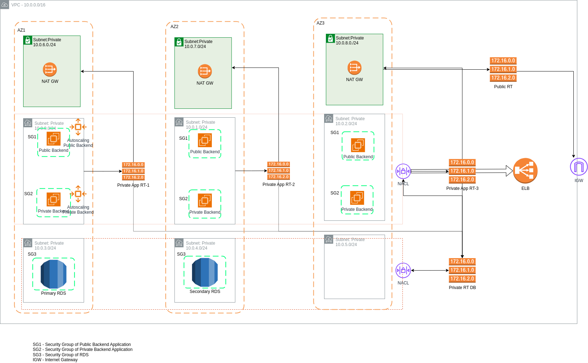
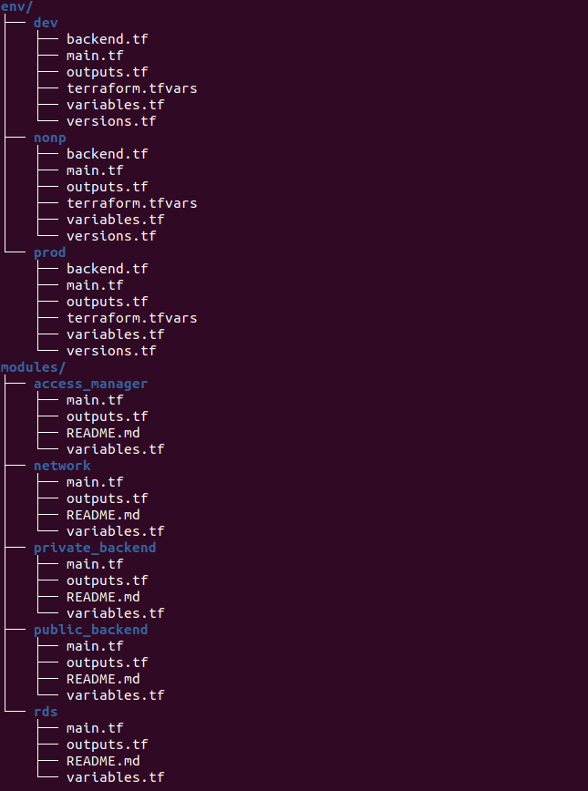

# Root Terraform Configuration for AWS Infrastructure

## Overview
This repository aims to utilize Terraform for designing AWS infrastructure according to the provided use-case.


This Terraform configuration orchestrates the deployment of a comprehensive AWS infrastructure, including networking, RDS databases, access management, and backend applications behind public and private load balancers. It leverages multiple sub-modules to manage resources effectively across different AWS services.

## Infrastructure Architecture Diagram

Below is the diagram illustrating the overall infrastructure setup:



## Terraform Multi-env Module Structure

In this architecture we would have one folder containing all the resource configurations files including variables and output config files. Then we will create separate folders for dev and stage, where we will define module block, provider block, backend configuration etc.




## Connect to Ec2 Instances

By leveraging SSM Session Manager, you gain a secure and centralized approach to accessing your EC2 instances, improving overall security and manageability.

- **Enhanced Security**: Eliminates the need to manage SSH keys or open inbound SSH ports on your security groups, reducing the attack surface.
- **Centralized Management**: Manage access from a single location using IAM policies.
- **Auditing & Logging**: Track and audit all access attempts for improved security posture.

## Backend Configuration

### Terraform State Management

Terraform's state is managed in an S3 bucket with the following configuration:

- **Bucket**: The S3 bucket where the Terraform state files are stored.
- **Key**: The path within the bucket where the state file is saved.
- **Region**: The AWS region where the S3 bucket resides.
- **Encrypt**: Ensures that the state file is encrypted at rest.
- **DynamoDB Table**: Uses DynamoDB for state locking to prevent concurrent runs of Terraform that could lead to conflicts.

To implement this locking mechanism, execute the following commands within **backend-setup module** to set up an encrypted S3 bucket and a DynamoDB table:

```bash
terraform init
terraform plan
terraform apply
```
This setup ensures that the Terraform state is securely stored and managed, providing a robust framework for team collaboration and version control.

## Modules

### Network Module
- **Source**: `../.../../modules/network`
- **Purpose**: Sets up VPC, subnets, and associated networking resources.
- **Variables**:
  - `region`
  - `availability_zones`
  - `vpc_cidr`
  - `inbound_ports`
  - `rds_egress_from_port`
  - `rds_egress_to_port`

### RDS Module
- **Source**: `../.../../modules/rds`
- **Purpose**: Provisions RDS instances for database management.
- **Dependencies**: Relies on the network module for subnet IDs and security group settings.

### Access Manager Module
- **Source**: `../.../../modules/access_manager`
- **Purpose**: Manages access credentials and KMS keys.
- **Dependencies**: Dependent on the RDS module for KMS ARNs.

### Public Backend Application Module
- **Source**: `../.../../modules/public_backend`
- **Purpose**: Deploys a backend application accessible via an ALB.
- **Dependencies**: Depends on the network, access manager, and RDS modules for networking and security configurations.

### Private Backend Application Module
- **Source**: `../.../../modules/private_backend`
- **Purpose**: Deploys a backend application accessible via an NLB.
- **Dependencies**: Depends on the network, access manager, and RDS modules for networking and security configurations.

## Variables for Terraform Configuration

This document outlines the variables used in the Terraform configuration, specifying their roles and data types to ensure clarity and correct usage in provisioning AWS infrastructure.

### Using terraform.tfvars for Variable Assignment

To streamline the process of passing variables to Terraform, use a `terraform.tfvars` file. This file allows you to define values for your Terraform variables in a simple key-value format, which Terraform automatically loads during operations.

### General Configuration

- **region**: AWS region where the resources will be provisioned. Default is `us-east-1`.
- **env**: Deployment environment, e.g., `dev`, `prod`. Default is `dev`.
- **availability_zones**: List of availability zones for subnet creation.
- **vpc_cidr**: The CIDR block for the VPC.
- **inbound_ports**: List of inbound ports for which network ACLs and security group rules will be created.

### RDS Configuration

- **rds_egress_from_port**: Starting port range for outgoing traffic from the RDS instances.
- **rds_egress_to_port**: Ending port range for outgoing traffic to the RDS instances.
- **db_identifier**: Identifier for the RDS instance.
- **db_instance_class**: The instance type of the RDS database.
- **db_engine**: Database engine type, e.g., `mysql`, `postgres`.
- **db_engine_version**: Version of the database engine.
- **db_storage**: Allocated storage space for the database (in GB).
- **db_storage_type**: Type of storage for the database, e.g., `standard`, `gp2`.
- **db_username**: Username for the database administrator.
- **backup_retention_period**: Number of days to retain backups.

### Public Backend Application

- **public_app_ami**: AMI ID for the EC2 instances in the public subnet.
- **alb_name**: Name for the Application Load Balancer.
- **alb_tg_port**: Port number for the ALB target group.
- **alb_tg_protocol**: Protocol used by the ALB target group.
- **alb_listener_port**: Listener port for the ALB.
- **alb_listener_protocol**: Listener protocol for the ALB.

### Private Backend Application

- **private_app_ami**: AMI ID for the EC2 instances in the private subnet.
- **nlb_name**: Name for the Network Load Balancer.
- **nlb_tg_port**: Port number for the NLB target group, default is `80`.
- **nlb_tg_protocol**: Protocol used by the NLB target group, default is `TCP`.
- **nlb_listener_port**: Listener port for the NLB, default is `80`.
- **nlb_listener_protocol**: Listener protocol for the NLB, default is `TCP`.

### EC2 Instance Configuration

- **instance_type**: Type of the EC2 instances.
- **min_size**: Minimum size of the Auto Scaling group.
- **max_size**: Maximum size of the Auto Scaling group.
- **desired_capacity**: Desired number of instances in the Auto Scaling group.

### Usage

Ensure that all variables are correctly defined in your Terraform configurations to prevent runtime errors and ensure that resources are provisioned as expected.


## Outputs

To enhance the usability and management of deployed resources, Outputs for Terraform modules are:

- **VPC ID**: To reference the VPC in other configurations or modules.
- **RDS Endpoint**: Essential for applications to connect to the database.
- **Load Balancer DNS Name**: Critical for accessing the deployed applications.


# IAM Permissions for Terraform Configuration
To ensure secure and efficient provisioning of AWS resources through Terraform, the IAM role used by Terraform needs specific permissions. This document outlines the required permissions for each AWS service involved in the setup.

## Required Permissions

### Amazon VPC

- **Actions**:
  - `ec2:CreateVpc`
  - `ec2:DeleteVpc`
  - `ec2:ModifyVpcAttribute`
  - `ec2:DescribeVpcs`

### Subnets

- **Actions**:
  - `ec2:CreateSubnet`
  - `ec2:DeleteSubnet`
  - `ec2:ModifySubnetAttribute`
  - `ec2:DescribeSubnets`

### Security Groups

- **Actions**:
  - `ec2:CreateSecurityGroup`
  - `ec2:DeleteSecurityGroup`
  - `ec2:AuthorizeSecurityGroupIngress`
  - `ec2:AuthorizeSecurityGroupEgress`
  - `ec2:RevokeSecurityGroupEgress`
  - `ec2:RevokeSecurityGroupIngress`
  - `ec2:DescribeSecurityGroups`

### AWS RDS

- **Actions**:
  - `rds:CreateDBInstance`
  - `rds:DeleteDBInstance`
  - `rds:ModifyDBInstance`
  - `rds:DescribeDBInstances`
  - `rds:CreateDBSnapshot`
  - `rds:RestoreDBInstanceFromDBSnapshot`

### Amazon S3 (Terraform State Management)

- **Actions**:
  - `s3:ListBucket`
  - `s3:GetBucketLocation`
  - `s3:CreateBucket`
  - `s3:DeleteBucket`
  - `s3:GetObject`
  - `s3:PutObject`
  - `s3:DeleteObject`

### DynamoDB (State Locking)

- **Actions**:
  - `dynamodb:CreateTable`
  - `dynamodb:DeleteTable`
  - `dynamodb:PutItem`
  - `dynamodb:GetItem`
  - `dynamodb:DeleteItem`
  - `dynamodb:DescribeTable`

### Elastic Load Balancers (ALB & NLB)

- **Actions**:
  - `elasticloadbalancing:*`

### AWS EC2 for Instances

- **Actions**:
  - `ec2:RunInstances`
  - `ec2:TerminateInstances`
  - `ec2:DescribeInstances`
  - `ec2:DescribeInstanceStatus`
  - `ec2:StopInstances`
  - `ec2:StartInstances`

### IAM for Role and Policy Management

- **Actions**:
  - `iam:CreateRole`
  - `iam:DeleteRole`
  - `iam:AttachRolePolicy`
  - `iam:DetachRolePolicy`
  - `iam:PutRolePolicy`

### Secret Manager

- **Actions**:
  - `secretsmanager:GetSecretValue`,
  - `secretsmanager:DescribeSecret`,
  - `secretsmanager:PutSecretValue`,
  - `secretsmanager:CreateSecret`,
  - `secretsmanager:DeleteSecret`,
  - `secretsmanager:ListSecrets`,
  - `secretsmanager:TagResource`,
  - `secretsmanager:UpdateSecret`


## Best Practices

- **Principle of Least Privilege**: Always assign the minimum permissions necessary for Terraform to perform its tasks.
- **Regular Audits**: Regularly review and audit permissions to adapt to changes in the environment and maintain security.

Using these permissions, your Terraform setup can securely manage AWS resources. It is recommended to continuously review and tighten these permissions based on operational requirements and security policies.